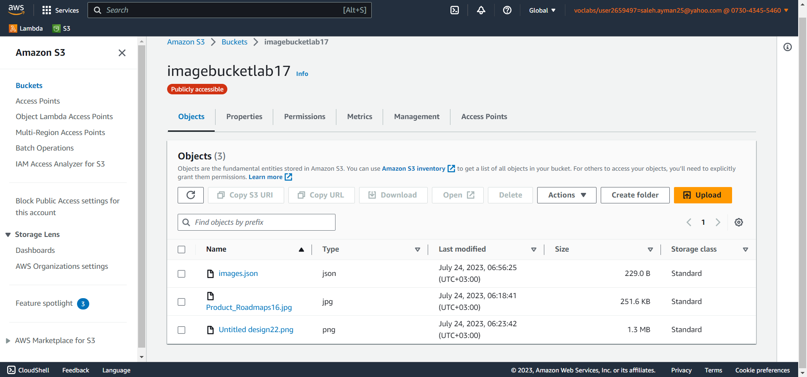
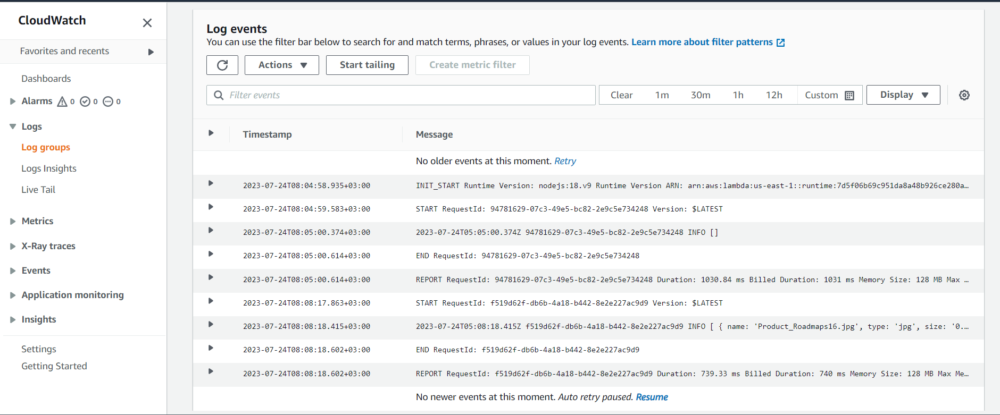
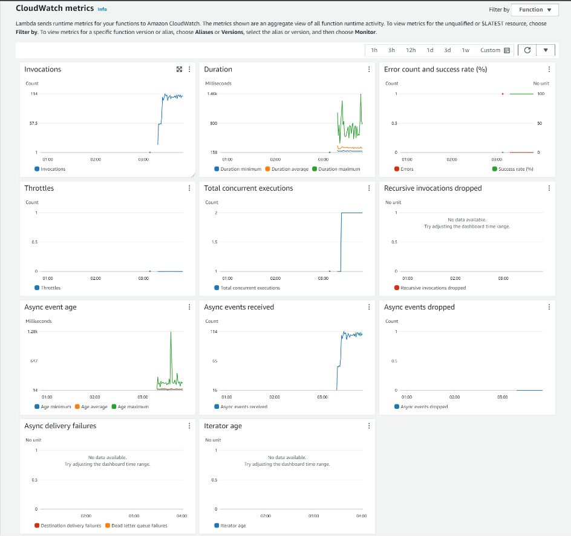
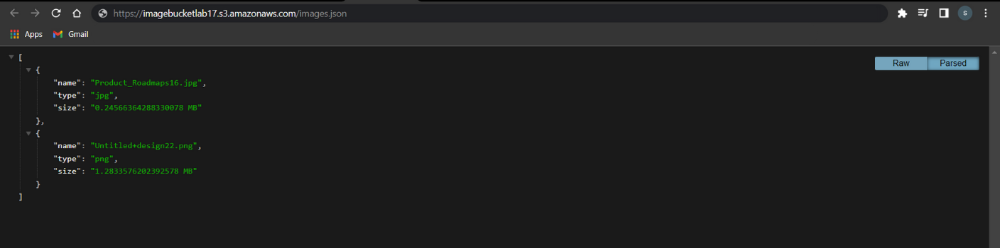

# image-lambda

#### Description :

- to use this code you need to:

    1- Create a s3 bucket, and make it public.
    2- Clone this repo.
    3- Install all the dependencies using `npm i`.
    4- Compress the `index.js, package.json, package-lock.json, and the node modules` folder to a zip archive.
    5- Create a new lambda function, then upload the zip archive to.
    6- Trigger the s3 bucket that you have created with the lambda function.

Now when you add a new image to the s3 bucket the function will work and add the metadata of the new image in the image.json file in the s3 bucket.

---

##### [link to image.json](https://imagebucketlab17.s3.amazonaws.com/images.json)

#### S3 bucket dashboard:

#### CloudWatch logs:

#### Lambda dashboard:

#### image.json:

